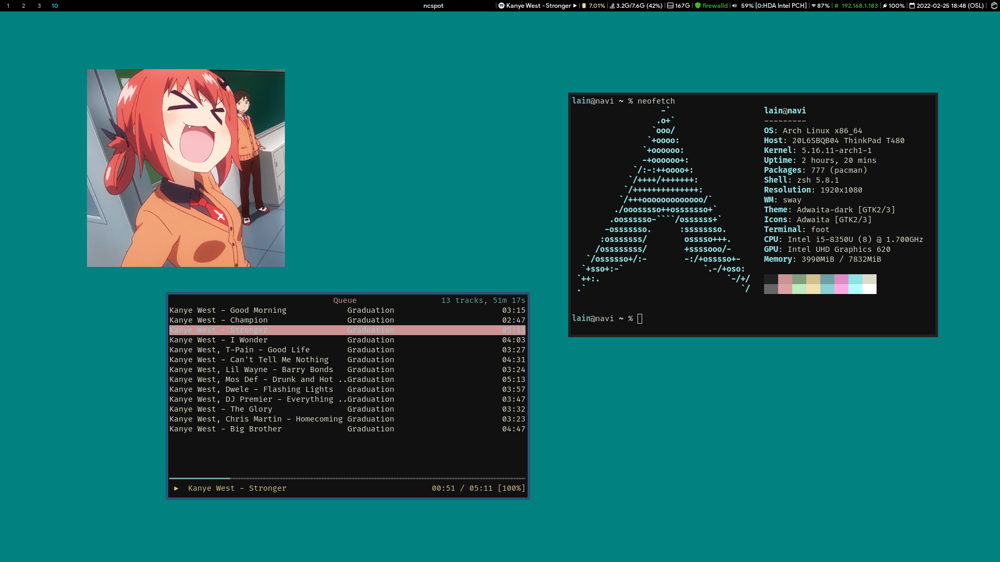

# dotfiles-sway
* sway: Tiling Wayland compositor and replacement for the i3 window manager
* grim: Screenshot utility
* foot: Fast, lightweight, and minimalistic Wayland terminal emulator
* mako: Lightweight notification daemon
* slurp: Select a region
* swayidle: Idle management daemon
* swaylock-effects: A fancier screen locker for Wayland.
* xorg-xwayland: X11 support
* fzf: Command-line fuzzy finder
* wob: A lightweight overlay volume/backlight/progress/anything bar for Wayland
* clipman: A simple clipboard manager for Wayland
* ncspot: Cross-platform ncurses Spotify client written in Rust, inspired by ncmpc and the likes.

